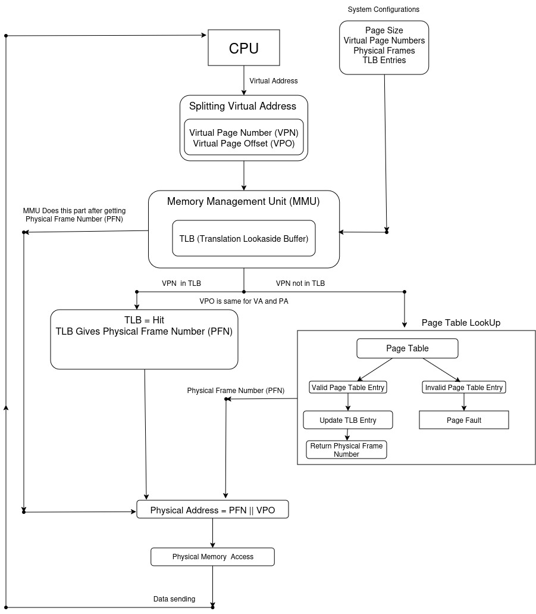

# Virtual Address Translation Simulator

A C++ simulator that models how a Memory Management Unit (MMU) translates virtual addresses into physical addresses using a Translation Lookaside Buffer (TLB), a page table, and simulated physical memory.

This project was built after studying the **Virtual Memory** chapter from *Computer Systems: A Programmer's Perspective (CS:APP)*. Rather than treating address translation as a static diagram, I wanted to implement the complete translation pipeline to better understand how these components interact.

---

## Why I Built This

Virtual memory is often introduced through diagrams that explain concepts such as virtual pages, page tables, TLBs, and physical memory. While those diagrams explain *what* happens, they don't provide the experience of implementing the translation process.

The goal of this project was to move beyond theory by building a simulator that models the behavior of a Memory Management Unit (MMU). Every memory access follows the same sequence used by the simulator, making the translation process easy to visualize and experiment with.

---

## Features

- Virtual to Physical Address Translation
- Translation Lookaside Buffer (TLB)
- TLB Hit and Miss Handling
- Page Table Lookup
- Page Fault Detection
- Simulated Physical Memory
- Read and Write Operations
- Configurable Memory Parameters
- Translation Statistics

---

# Architecture & Translation Flow

<p align="center">
  
</p>

The simulator models the logical behavior of an MMU during address translation.

For each memory access:

- The CPU generates a virtual address.
- The MMU splits it into a Virtual Page Number (VPN) and Virtual Page Offset (VPO).
- The VPN is first searched in the TLB.
- On a TLB hit, the corresponding Physical Frame Number (PFN) is immediately returned.
- On a TLB miss, the page table is consulted.
- If a valid mapping exists, the PFN is returned and the TLB is updated.
- If no valid mapping exists, a page fault is reported.
- The PFN is combined with the unchanged offset to construct the physical address.
- The physical memory is then accessed for the requested read or write operation.

---

## Project Structure

```text
VirtualAddressTranslationSimulator/
│
├── include/
│   ├── MMU.h
│   ├── PageTable.h
│   ├── PhysicalMemory.h
│   └── TLB.h
│
├── src/
│   ├── MMU.cpp
│   ├── PageTable.cpp
│   ├── PhysicalMemory.cpp
│   └── TLB.cpp
│
├── main.cpp
├── CMakeLists.txt
└── README.md
```

---

## Building

Clone the repository.

```bash
git clone https://github.com/yourusername/VirtualAddressTranslationSimulator.git
```

Build the project.

```bash
mkdir build
cd build

cmake ..
make
```

Run the simulator.

```bash
./run.sh
```

---

## Design Decisions

This project intentionally models the **behavior** of an MMU instead of emulating a real processor architecture.

The simulator uses:

- A simplified page table
- A software-modeled TLB
- Simulated physical memory
- Configurable memory parameters

These design choices keep the implementation focused on understanding virtual address translation while avoiding architecture-specific details.

---

## Limitations

This simulator does **not** attempt to emulate:

- x86 page table formats
- Multi-level page tables
- CR3 register
- Hardware caches
- Kernel page fault handling
- Demand paging
- Disk-backed virtual memory
- Process context switching

Its purpose is to demonstrate the core translation algorithm used by a Memory Management Unit.

---

## References

- Randal E. Bryant
- David R. O'Hallaron

**Computer Systems: A Programmer's Perspective (3rd Edition)**

Chapter 9 — Virtual Memory