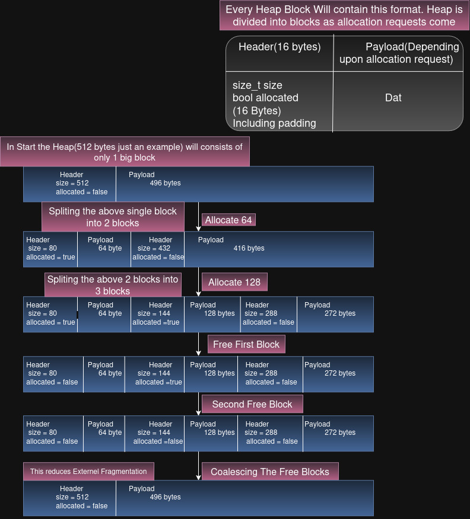

# Toy Memory Allocator

A C++ implementation of a simplified dynamic memory allocator that models the core algorithms behind `malloc()` using an implicit free list, First-Fit allocation, block splitting, and coalescing.

This project was built after studying **Chapter 9 — Virtual Memory** from *Computer Systems: A Programmer's Perspective (CS:APP)*. While a previous project in this series explored virtual address translation, this project focuses on understanding how dynamic memory is organized and managed inside a heap.

Rather than relying on the system allocator, I implemented the core allocation algorithms from scratch to better understand how memory allocators organize, allocate, and reclaim heap memory.

---

## Why I Built This

Dynamic memory allocation is one of the most fundamental services provided by an operating system and runtime library, yet `malloc()` often appears as a black box to programmers.

Behind every allocation request, an allocator must answer questions such as:

- Which free block should satisfy the request?
- How is free memory tracked?
- How does `free()` recover metadata?
- How are large free blocks split?
- How is fragmentation reduced over time?

This project implements a simplified allocator to explore those mechanisms and understand how heap memory is managed internally.

---

## Features

- Fixed contiguous heap
- Block headers
- Implicit free list
- First-Fit allocation
- Block splitting
- Block deallocation
- Adjacent block coalescing
- Heap layout visualization

---

# Architecture & Translation Flow

<p align="center">
  
</p>

The diagram above illustrates the complete lifecycle of the allocator.

Starting with a single free block, the allocator:

- Splits blocks to satisfy allocation requests.
- Stores allocation metadata inside block headers.
- Returns pointers to the payload only.
- Marks blocks as free during deallocation.
- Merges adjacent free blocks through coalescing to reduce external fragmentation.

---

## Memory Block Layout

Every block inside the heap follows the same structure.

```text
+----------------------+----------------------+
|     Block Header     |      Payload         |
+----------------------+----------------------+
| size                 | User Data            |
| allocation flag      | Returned to caller   |
+----------------------+----------------------+
```

The allocator never exposes the block header to the user. Instead, it returns a pointer to the payload while keeping the metadata hidden immediately before it.

---

## Project Structure

```text
ToyMemoryAllocator/
│
├── inc/
│   ├── Heap.hpp
│
├── src/
│   ├── Heap.cpp
│   └── main.cpp
│
├── tests/
│   └── tests.cpp
│   └── test.hpp
├── assets/
│   └── malloc.svg
│   └── malloc.jpg
├── CMakeLists.txt
└── README.md
```

---

## Building

```bash
git clone https://github.com/arham6606/systems-programming-labs.git

cd toy_malloc

mkdir build
cd build

cmake ..
make
```

Run

```bash
./run.sh
```

---

## Design Decisions

This project intentionally implements the simplified implicit free-list allocator presented in **Computer Systems: A Programmer's Perspective (CS:APP)**.

The implementation focuses on understanding allocator internals rather than reproducing a production allocator.

Design choices include:

- Fixed contiguous heap
- Implicit free list
- First-Fit allocation strategy
- Block splitting
- Adjacent block coalescing

These choices keep the implementation focused on the fundamental algorithms that underlie dynamic memory allocation.

---

## Limitations

This allocator intentionally does **not** implement:

- Thread safety
- `realloc()`
- `calloc()`
- Explicit free lists
- Segregated free lists
- Buddy allocation
- Multiple arenas
- `mmap()` / `sbrk()`
- Production allocator optimizations

Its purpose is to demonstrate the core allocation algorithms taught in CS:APP rather than replicate modern allocators such as glibc `malloc`, jemalloc, or mimalloc.

---

## References

- Randal E. Bryant
- David R. O'Hallaron

**Computer Systems: A Programmer's Perspective (3rd Edition)**

Chapter 9 — Virtual Memory
